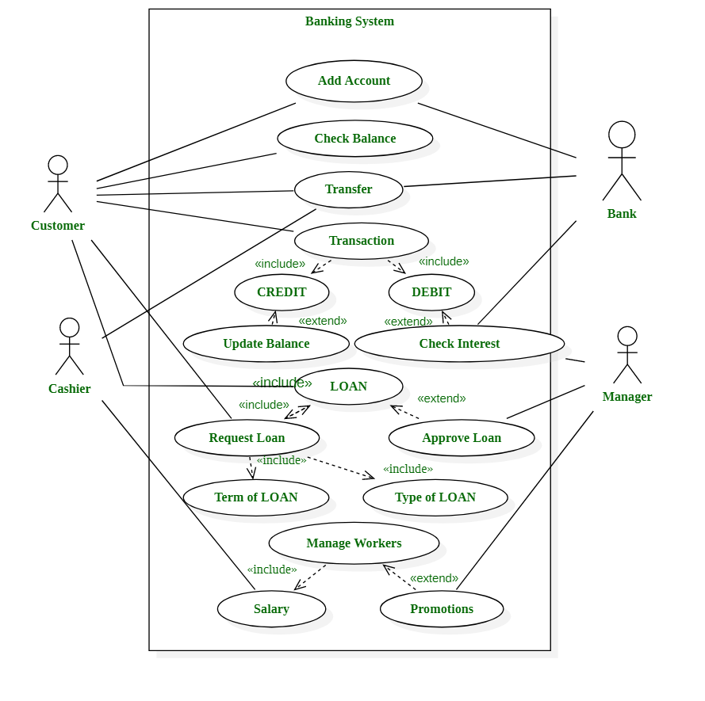
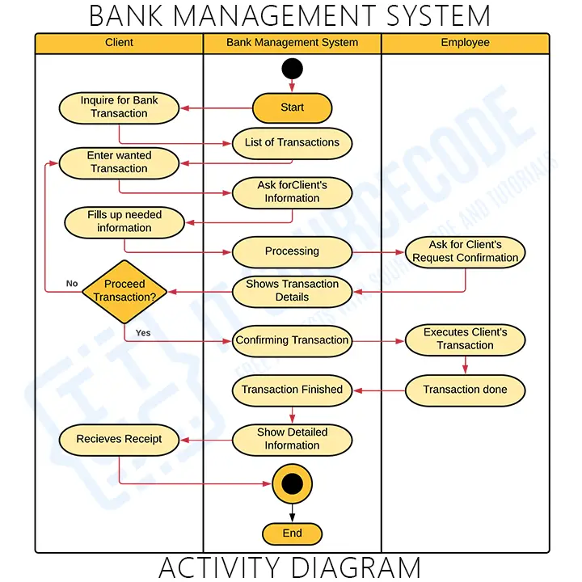
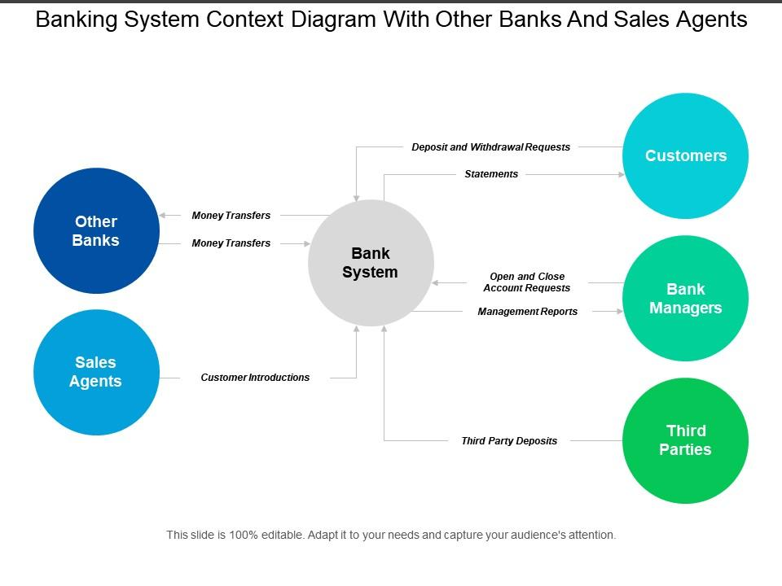
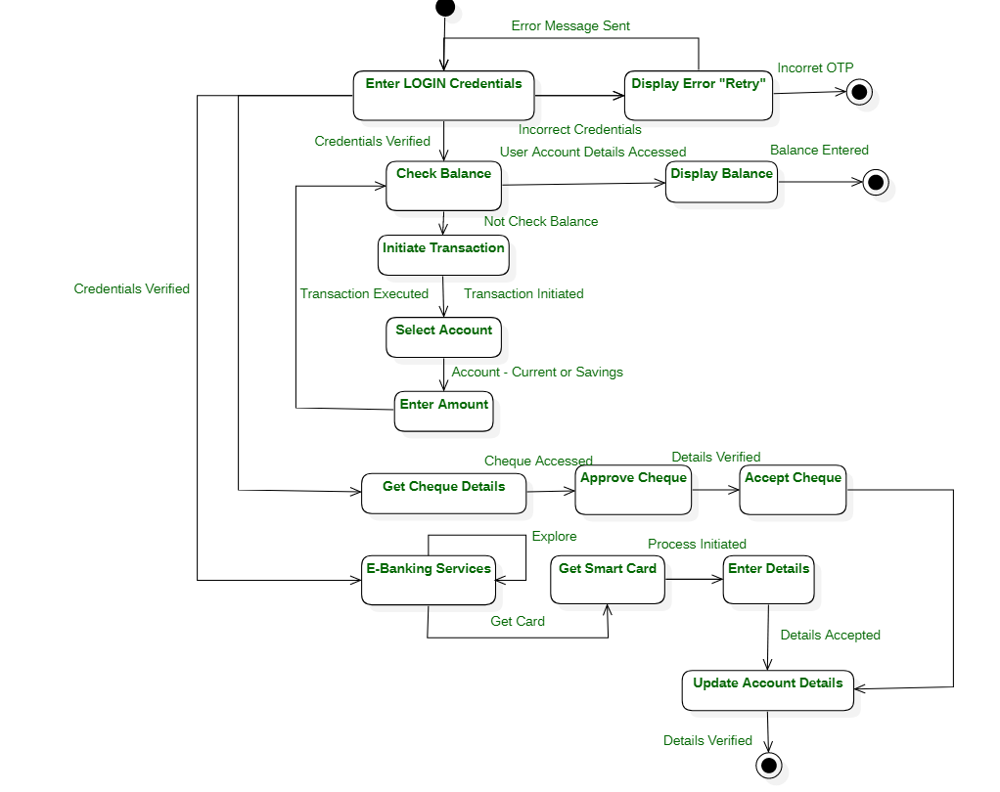
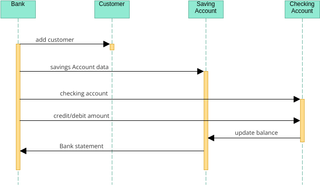

# Software Requirements Specification (SRS)

## Project Name: Bank Management System

### Preface

This document provides the Software Requirements Specification (SRS) for the Bank Management System. It defines the system’s functionalities, performance criteria, security requirements, database structure, and overall architecture necessary for development.

## 1. Introduction

### Purpose

The Bank Management System is a web-based application designed to improve banking operations by managing customer accounts, transactions, loans, employees, and financial reporting. The system enables secure banking services, reduces manual workload, and enhances customer satisfaction.

### Document Conventions

This document follows the IEEE SRS standard, using:

* Must – Indicates mandatory requirements
* Should – Indicates recommended features
* May – Indicates optional enhancements

### Intended Audience and Reading Suggestions

**Project Managers & Developers** – System implementation guidance

**Stakeholders & Business Analysts** – Understanding system capabilities

**Testers & QA Teams** – Requirement validation

### Scope

The system provides:

* Customer account management
* Transaction processing
* Loan management
* Employee management
* Billing and payment services
* Reporting and analytics
* Role-based access control

### References

* IEEE Standard 830-1998 (Software Requirements Specification)
* Internal Business Requirement Specification (BRS)
* System Modeling Documentation

---

## 2. Overall Description

### Product Perspective

The Bank Management System is a standalone web application with optional integration for online payment gateways, ATM services, and mobile banking platforms.

### Product Functions

#### Customer Account Management

* Create and manage customer accounts
* Update customer information

#### Transaction Management

* Deposit, withdraw, and transfer funds
* Track transaction history

#### Loan Management

* Process loan applications
* Manage loan repayments

#### Employee Management

* Manage employee records and roles

#### Billing & Payment

* Process utility bill payments
* Support multiple payment methods

#### Reporting

* Daily transaction reports
* Customer account reports
* Loan reports

### User Classes and Characteristics

#### Admin

* Manages users, settings, and reports

#### Bank Employee

* Handles customer accounts and transactions

#### Customer

* Manages accounts and views transaction history

### Operating Environment

* Web-based application
* Cloud-hosted deployment
* Database: MongoDB

### Design and Implementation Constraints

* Secure authentication required
* Responsive interface
* Compliance with banking regulations and data protection standards

### Assumptions and Dependencies

* Internet connection required
* Third-party payment services availability
* Banking network availability

---

## 3. System Requirements Specification

### Functional Requirements

#### User Authentication

* Users must register and log in
* Password reset functionality
* Role-based access

#### Customer Account Management

* Employees must create and update customer accounts
* Customers can view account details and balances

#### Transaction Management

* Customers can deposit, withdraw, and transfer funds
* System records transaction history

#### Loan Management

* Employees can approve or reject loan requests
* Customers can track loan status

#### Payment System

* Process bill payments
* Store payment records

#### Reporting

* Export reports in PDF and CSV

### Non-Functional Requirements

#### Performance Requirements

* Support 1000+ concurrent users
* Real-time transaction updates

#### Security Requirements

* Role-based authorization
* Encrypted user information
* Secure transaction processing

#### Usability Requirements

* User-friendly interface
* Accessibility support

#### Reliability and Availability

* 99.9% uptime
* Backup and recovery support

#### Maintainability

* Modular architecture
* Logging and debugging support

#### Portability

* Support Windows, Linux, and Mac

---

## 4. System Models

### ENTITY–RELATIONSHIP (ER) DIAGRAM
<h3>ER Diagram</h3>

<h3>Use Case Diagram</h3>

<h3>Activity Diagram</h3>

<h3>Context Diagram</h3>

<h3>State Diagram</h3>

<h3>System Preview</h3>

**Main Entities**

#### Customer

* Customer_ID (PK)
* Name
* Phone
* Email
* Address

#### Account

* Account_ID (PK)
* Customer_ID (FK)
* Account_Type
* Balance
* Created_Date

#### Transaction

* Transaction_ID (PK)
* Account_ID (FK)
* Employee_ID (FK)
* Transaction_Type
* Amount
* Transaction_Date

#### Loan

* Loan_ID (PK)
* Customer_ID (FK)
* Loan_Amount
* Interest_Rate
* Status

#### Payment

* Payment_ID (PK)
* Account_ID (FK)
* Payment_Method
* Amount

#### Employee

* Employee_ID (PK)
* Name
* Role
* Branch

### Relationships

* Customer → Owns → Account (1:M)
* Account → Performs → Transaction (1:M)
* Customer → Applies For → Loan (1:M)
* Employee → Manages → Transaction (1:M)
* Account → Generates → Payment (1:M)
* Employee → Processes → Loan (1:M)

---

## 5. System Evolution

### Assumptions

* AI-based fraud detection may be integrated
* Mobile banking application support in future

### Expected Changes

* Online banking integration
* Customer loyalty and rewards program
* Advanced financial analytics dashboard

---

## 6. Appendices

### Hardware Requirements

* Cloud-based scalable infrastructure

### Database Requirements

* Must include logical data relationships
* Support indexing for performance
* Ensure data integrity and consistency

